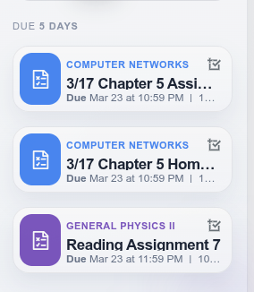
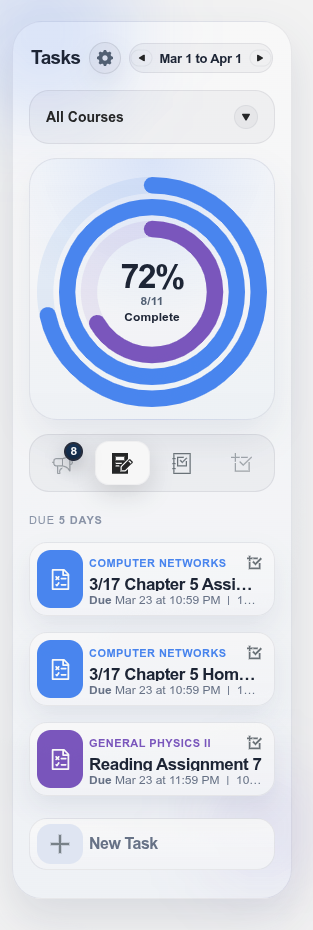
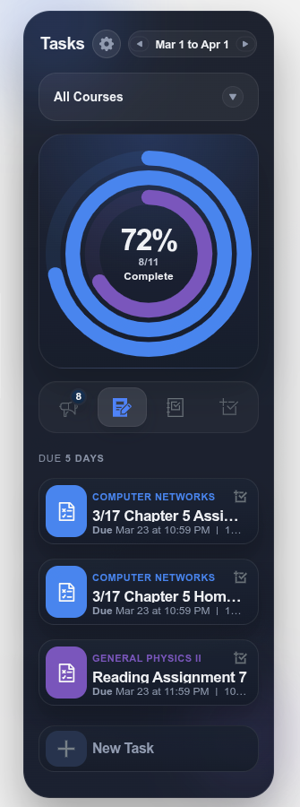
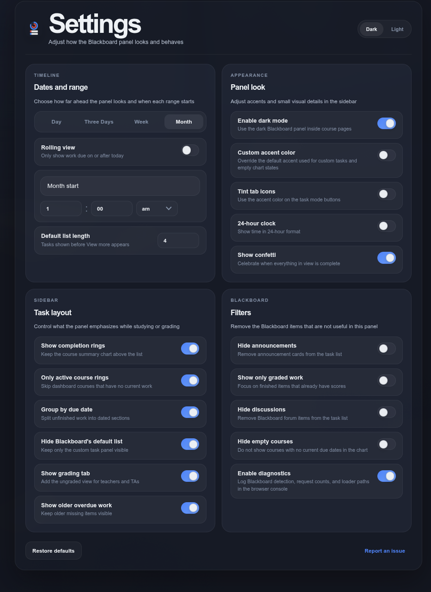

# Tasks Browser Extension for Blackboard

Ever had trouble finding weekly Blackboard assignments? Wish there was a cleaner progress view for current work?

Either way, the **Tasks Browser Extension for Blackboard** is here to help

## Fork Notice

This repository contains an unofficial fork of the open-source Tasks for Canvas browser extension.

- Original project:
https://github.com/UseBetterCanvas/canvas-task-extension

- Chrome Store Listing:
https://chromewebstore.google.com/detail/iobjgdiplbeimhchihcmfbefepnpfpnk?utm_source=item-share-cb

All credit for the original design, functionality, and ongoing development belongs to the original author and contributors.

## Why This Fork Exists

This fork exists somewhat backwards compared to a typical open-source workflow.

I originally made this modification for personal use, then kept extending it to better fit Blackboard-specific behavior, layout, and workflow needs that were outside the original project scope.

## What This Fork Changes

This fork focuses on Blackboard-first behavior rather than multi-LMS support. It trims out unrelated runtime paths, adjusts the UI for Blackboard use, adds Blackboard-specific loading and filtering logic, and keeps the extension tuned around the way Blackboard pages actually behave.

## Relationship To The Upstream Project

- This fork is unofficial
- It is not affiliated with or endorsed by the original author
- All upstream credit and licensing are preserved
- Users looking for the canonical version should use the original repository linked above

## Download
This repo is now only intended for Blackboard-focused use. I have no intention of supporting canvas.

(Canvas Is Better Than Blackboard Anyway)
## Features

### Stay on Track

Colorful task items ensure that you'll never miss an assignment again.

### Track Your Progress

Visual progress bars for each of your courses show how far you are in completing your assignments this week.

### Make It Your Own

Task items and progress bars correspond with your chosen dashboard colors and positions.

### Notes

- The sidebar only works in Card View and Recent Activity.
- Only courses that have assignments will appear in the chart.
- The **Unfinished** assignments list will show current Blackboard work that is still incomplete.

## Installing and Running for Development

### Procedures:

1. Check if [Node.js](https://nodejs.org/) is installed.
2. Clone this repository.
3. Install dependencies with either:
   - `bun install`
   - `npm install`
4. Build the extension with either:
   - `bun run build`
   - `npm run build`
5. If on Chrome: Load the extension following:
   1. Access `chrome://extensions/`
   2. Check `Developer mode`
   3. Click on `Load unpacked extension`
   4. Select the `build` folder.
5. If on Firefox: Load the extension following:
   1. Copy `src/manifest-firefox.json` to `build/manifest.json`
   2. Access `about:debugging`
   3. Click on `This Firefox`
   4. Click `Load Temporary Add-on`
   5. Select the `build` folder and click on `manifest.json`
7. Reload Blackboard and confirm the sidebar appears.

Useful development commands:

- `bun run build`
- `bun run test`
- `bun run zip`
- `npm run build`
- `npm run test`

Built with [Chrome Extension Boilerplate with React 17 and Webpack 5](https://github.com/lxieyang/chrome-extension-boilerplate-react.git)

## Browser Testing Status

This fork is currently only tested on Brave, which is Chromium-based.

Firefox support remains in the repository, but Gecko behavior is currently untested in this fork.
